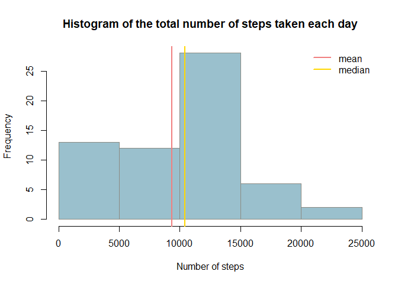
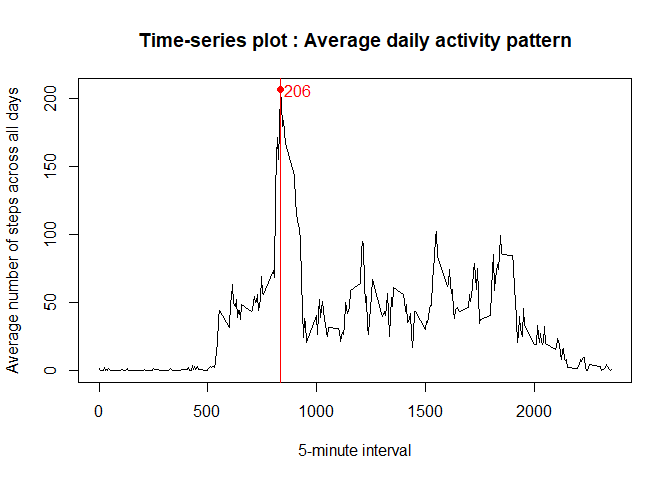
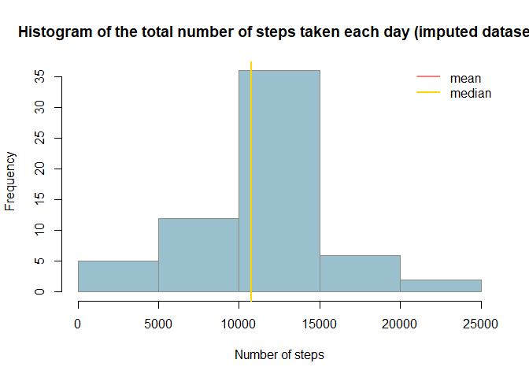
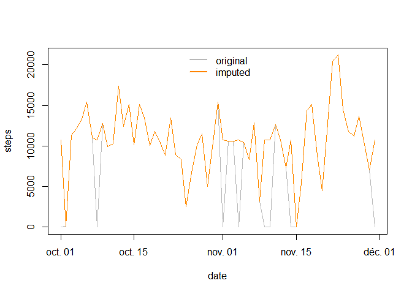
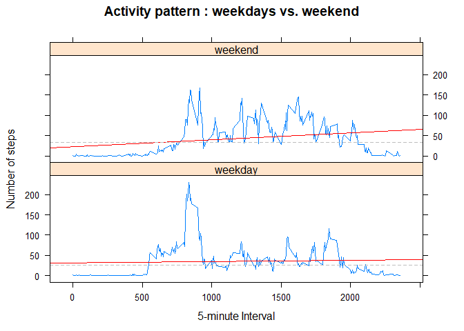

Load required library :  
- `lubridate` : date manipulation  
- `dplyr` : data transformation  
- `lattice` : plotting with panels  


```r
library(lubridate)
library(dplyr)
library(lattice)
```

## Loading and preprocessing the data

This section execute the following steps :  
1. Unzip the source file  
2. Load extracted CSV file into dataframe, keeping string "as is"  
3. Convert `date` field from character to class `Date` using `lubridate` package  


```r
unzip("activity.zip")
data <- read.csv("activity.csv", as.is=T)
data$date <- ymd(data$date)
```


## What is mean total number of steps taken per day?

First : aggregate total number of steps by day


```r
byday <- data %>% 
         group_by(date) %>% 
         summarise(steps=sum(steps, na.rm=T))
```


Then : plot result using base graphics method and compute `mean` and `median` values


```r
with(byday, 
     hist(steps, col="lightblue3", border="ivory4",
          main="Histogram of the total number of steps taken each day",
          xlab="Number of steps"))

byday.mn <- mean(byday$steps)
byday.md <- median(byday$steps)

abline(v=byday.mn, col="lightcoral", lwd=2)
abline(v=byday.md, col="gold", lwd=2)
legend("topright", c("mean", "median"), lty=1, lwd=2, col=c("lightcoral", "gold"), bty="n")
```

<!-- -->

**Answer : **  
- Mean = 9354    
- Median = 10395

## What is the average daily activity pattern?

First : aggregate average number of steps by interval and compute the maximum value


```r
byitv <- data %>% 
         group_by(interval) %>% 
         summarise(steps=mean(steps, na.rm=T))

max <- byitv[which.max(byitv$steps), c("interval", "steps")]
```

Then : plot the result using base graphics method


```r
with(byitv, 
     plot(interval, steps, type="l",
          main="Time-series plot : Average daily activity pattern",
          xlab="5-minute interval",
          ylab="Average number of steps across all days"))


abline(v=max$interval, col="red")
points(max$interval, max$steps, pch=19, col="red")
text(max$interval+80, max$steps, labels=round(max$steps), col="red")
```

<!-- -->

Which 5-minute interval, on average across all the days in the dataset, contains the maximum number of steps?  
  
**Answer** :   
Interval with maximum number of steps => **835** (number of steps=**206**)

## Imputing missing values

Missing values in the dataset :


```r
# total NAs in dataset
sum(is.na(data))
```

```
## [1] 2304
```

```r
# total NAs in steps variable
sum(is.na(data$steps))
```

```
## [1] 2304
```

```r
# percentage of NAs in steps variable
mean(is.na(data$steps))
```

```
## [1] 0.1311475
```

Missing values occur **only on `steps` variable** and when they occur, they occur on **all the intervals** of the concerning day :


```r
data %>% group_by(date) %>%
         summarize(NAs=sum(is.na(steps)), nrow=n()) %>%
         filter(NAs>0)
```

```
## # A tibble: 8 x 3
##   date         NAs  nrow
##   <date>     <int> <int>
## 1 2012-10-01   288   288
## 2 2012-10-08   288   288
## 3 2012-11-01   288   288
## 4 2012-11-04   288   288
## 5 2012-11-09   288   288
## 6 2012-11-10   288   288
## 7 2012-11-14   288   288
## 8 2012-11-30   288   288
```


**Imputing strategy :** replace missing intervals in the original dataset for a particular day with the rounded mean of that same interval across all days  

Create the new dataset : join interval means to original dataset and substitute NAs with corresponding mean value


```r
data.imp <- merge(data, byitv, by="interval", sort=F) %>%  # join
            mutate(steps=ifelse(is.na(steps.x), round(steps.y), steps.x)) %>%  # substitute
            select(steps, date, interval) %>%  # select useful variables
            arrange(date, interval) # re-order resulting dataset
```

Aggregate by day and plot the result 


```r
byday.imp <- data.imp %>% group_by(date) %>% summarise(steps=sum(steps))

with(byday.imp,
     hist(steps, col="lightblue3", border="ivory4",
          main="Histogram of the total number of steps taken each day (imputed dataset)",
          xlab="Number of steps"))

byday.imp.mn <- mean(byday.imp$steps)
byday.imp.md <- median(byday.imp$steps)

abline(v=byday.imp.mn, col="lightcoral", lwd=2)
abline(v=byday.imp.md, col="gold", lwd=2)
legend("topright", c("mean", "median"), lty=1, lwd=2, col=c("lightcoral", "gold"), bty="n")
```

<!-- -->

**Answer : **  
- Mean = 10766 (compared to 9354)    
- Median = 10762 (compared to 10395)

> Do these values differ from the estimates from the first part of the assignment?  

Values are greater Compared to the first part of the assignment, also mean and median get closer.


> What is the impact of imputing missing data on the estimates of the total daily number of steps?  

The total daily number of steps is greater, the overall curve is "smoother" 


```r
with(byday, plot(date, steps, type="l", col="gray"))
with(byday.imp, lines(date, steps, col="darkorange"))
legend("top", c("original", "imputed"), lty=1, lwd=2, col=c("gray", "darkorange"), bty="n")
```

<!-- -->


## Are there differences in activity patterns between weekdays and weekends?

First : append weekday factor using week_start=1 (to make sure Monday=1)


```r
data.imp$wday <- factor(ifelse(wday(data.imp$date, week_start=1) < 6, "weekday", "weekend"))
```

Then : aggregate and plot result in horizontal panel using `lattice` package


```r
byitv.imp <- data.imp %>% 
             group_by(wday, interval) %>% 
             summarise(steps=mean(steps))

xyplot(steps ~ interval | wday, 
       data = byitv.imp, 
       type="l",
       layout=c(1,2),
       main="Activity pattern : weekdays vs. weekend",
       xlab="5-minute Interval",
       ylab="Number of steps",
       panel = function(x, y, ...) {
                 panel.xyplot(x, y, ...)
                 panel.lmline(x, y, col="red")
                 panel.abline(h = median(y), lty = 2, col="gray")
               })
```

<!-- -->
  

Note : weekdays and weekend activity have the same overall pattern, a little bit more steps during and along the weekends
